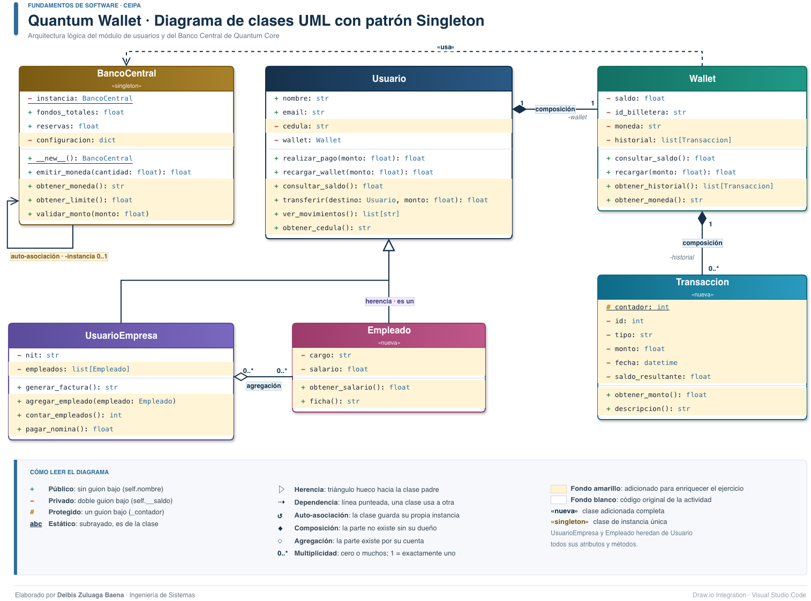

# Semana 6 · Actividad 2 — El patrón de diseño Singleton

Implementación del patrón **Singleton** en el Banco Central de Quantum Core y su integración
en el diagrama de clases de la Quantum Wallet. El Banco Central es la única instancia de
control del sistema: administra los fondos, la emisión de moneda y la configuración global.



## Código original y elementos adicionados

`banco_central.py` integra las dos versiones publicadas del código original de la actividad:

| Elemento | Origen |
|---|---|
| `__instancia` privada, `fondos_totales`, mensaje de creación | Enunciado de Canvas |
| `reservas`, `emitir_moneda()`, demostración con `id()` y ciclo de 100 intentos | Repositorio del curso |
| Configuración global: `obtener_moneda()`, `obtener_limite()`, `validar_monto()` | **Adicionado** para enriquecer el ejercicio |

> **Integración con la Quantum Wallet.**
> `usuarios.py` es el modelo de la actividad anterior. La `Wallet` ahora consulta al
> `BancoCentral` la moneda del sistema y valida el límite por transacción en `recargar()`.
> Cada línea adicionada está marcada con `[AGREGADO]`.

## El patrón en el diagrama

| Elemento UML | Representación |
|---|---|
| Estereotipo `«singleton»` | Debajo del nombre `BancoCentral` |
| Atributo estático | `- instancia: BancoCentral`, **subrayado** y privado |
| Punto de creación | `+ __new__(): BancoCentral`, subrayado |
| Auto-asociación | Línea de `BancoCentral` hacia sí misma, multiplicidad `0..1` |
| Dependencia `«usa»` | Línea punteada de `Wallet` hacia `BancoCentral` |

Filas con **fondo blanco**: código original de las actividades. Filas con **fondo amarillo**:
elementos adicionados para enriquecer el ejercicio.

## ¿Por qué `__new__` y no `__init__`?

`__new__` **crea** el objeto y se ejecuta antes que `__init__`; ahí se decide si se crea una
instancia nueva o se devuelve la existente. `__init__` se ejecutaría en cada invocación y
reiniciaría los fondos, por eso la clase no lo define.

## Cómo ejecutar

```bash
python3 banco_central.py            # demostración del Singleton
python3 comprobacion_singleton.py   # verificación y comparación con una clase común
python3 usuarios.py                 # Quantum Wallet usando la configuración del Banco Central
```

**Salida esperada de `comprobacion_singleton.py`**

```text
1. INSTANCIA UNICA
Creando el Banco Central por única vez...
   a is b: True | id(a) == id(b): True
   Objetos distintos tras 100 intentos: 1
2. ATRIBUTO ESTATICO PRIVADO
   'instancia' pertenece a la clase: True
   Acceso directo a BancoCentral.__instancia -> AttributeError (privado)
3. DATOS GLOBALES COMPARTIDOS
   Reservas vistas desde a: 1500 | desde b: 1500
   Moneda de dos billeteras distintas: COP y COP
   Recarga de 60.000.000 -> ValueError: el monto supera el limite por transaccion
4. SIN SINGLETON (comparacion)
   x is y: False
   Reservas en x: 1000 | en y: 500 -> datos inconsistentes
   Objetos distintos tras 100 intentos: 100
```

> Con el Singleton, 100 invocaciones producen **1** objeto y las reservas se comparten (1500).
> Con una clase común se crean **100** objetos y cada uno lleva sus propias reservas.

**Salida esperada de `banco_central.py`** (los identificadores de memoria cambian en cada ejecución)

```text
Creando el Banco Central por única vez...
Es el mismo banco? True
id(banco_a): 139831256677904
id(banco_b): 139831256677904
Son el mismo objeto?: True
id(ultimo): 139831256677904
id(ultimo): 139831256677904
...  (98 líneas más con el mismo identificador)
El #100 es el mismo?: True
Reservas totales (compartidas): 1500
Moneda del sistema: COP
Limite por transaccion: 50000000
```

## Herramienta de modelado

Diagrama elaborado con **Draw.io Integration** (Henning Dieterichs, v1.11.0) en Visual Studio Code.
Para editarlo: abrir `diagrama_clases_singleton.drawio` desde VS Code, guardar con `Cmd+S` y
exportar con *File → Export*.

## Archivos

| Archivo | Qué es |
|---|---|
| `Semana6_Actividad2_Patron_Singleton_Deibis_Zuluaga.pdf` | Informe técnico: diagrama, implementación, principios de diseño y análisis de riesgos (12 páginas) |
| `banco_central.py` | Clase `BancoCentral` con el patrón Singleton |
| `usuarios.py` | Modelo de la Quantum Wallet integrado con el Banco Central |
| `comprobacion_singleton.py` | Script de verificación (no forma parte del modelo) |
| `diagrama_clases_singleton.drawio` | Fuente del diagrama, editable con Draw.io Integration |
| `diagrama_clases_singleton.png` | Diagrama exportado, formato de entrega |
| `diagrama_clases_singleton.svg` | Versión vectorial del diagrama |

---

Deibis Zuluaga · Fundamentos de Software · Ingeniería de Sistemas, CEIPA
